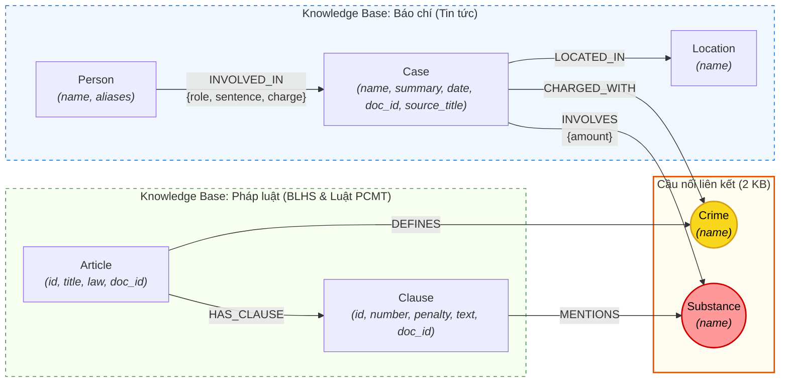

# Thiết kế Ontology — Day 19

**Họ tên:** Dương Minh Hiếu  **MSSV:** 2A202602488

**Lựa chọn** (đánh dấu một):
- [x] Dùng ontology gợi ý (có tinh chỉnh và chuẩn hóa tối ưu cho GraphRAG)
- [ ] Tự thiết kế (xét bonus +15, xem `SUBMISSION.md`)

> Hướng dẫn: `LAB_GUIDE.md` Bước 2. Dùng ontology gợi ý thì vẫn phải điền đủ các mục dưới đây bằng lời của bạn.

## 1. Sơ đồ

Sơ đồ mô hình hóa mối quan hệ giữa 2 Knowledge Base: **KB Luật** (`data/drug_law/`) và **KB Báo chí** (`data/drug_news/`).
Hai node cầu nối liên kết xuyên suốt 2 KB là **`Crime`** (cầu nối pháp lý chính) và **`Substance`** (cầu nối định tính tang vật).

## 2. Entity types (node labels)

| Label | Ý nghĩa | Khóa định danh (`MERGE` theo) | Properties | Lấy từ KB nào | Trích bằng (regex / LLM / khác) |
| --- | --- | --- | --- | --- | --- |
| **`Article`** | Điều luật trong văn bản pháp luật (BLHS, Luật PCMT) | `id` (ví dụ: `"Điều 251 BLHS"`) | `id`, `title`, `law`, `doc_id` | KB Luật | **Regex** (`parse_law_article` trích xuất từ metadata và tiêu đề Markdown) |
| **`Clause`** | Khoản của một Điều luật, chứa quy định khung hình phạt hoặc định nghĩa | `id` (ví dụ: `"Điều 251 BLHS khoản 1"`) | `id`, `number`, `penalty`, `text`, `doc_id` | KB Luật | **Regex** (`CLAUSE_START` bắt đầu dòng số `1.`, `2.`, regex tìm `penalty`) |
| **`Crime`** *(Cầu nối)* | Tội danh pháp lý chuẩn mực (ví dụ: `"mua bán trái phép chất ma túy"`) | `name` (tên tội đã chuẩn hóa viết thường, bỏ tiền tố "tội") | `name` | Cả 2 KB (Luật định nghĩa, Tin tức quy kết) | Luật trích bằng **Regex/String** (`normalize_crime`), Tin tức trích bằng **LLM + `link_entity`** |
| **`Substance`** *(Cầu nối)* | Chất ma túy, tiền chất cụ thể (Heroine, MDMA, Ketamine...) | `name` (tên chuẩn hóa theo danh mục quy định) | `name` | Cả 2 KB (Luật định khung, Tin tức là tang vật) | Luật trích bằng **Regex** (`find_substances`), Tin tức trích bằng **LLM + canonical list** |
| **`Case`** | Vụ án / Vụ việc ma túy cụ thể được đưa tin | `name` (tên ngắn đặc trưng của vụ án do LLM gán) | `name`, `summary`, `date`, `doc_id`, `source_title` | KB Báo chí | **LLM** (`extract_news_cases` với prompt có JSON schema) |
| **`Person`** | Đối tượng liên quan trong vụ án (bị can, bị cáo, trùm giang hồ...) | `name` (họ và tên đầy đủ của đối tượng) | `name`, `aliases` (danh sách biệt danh) | KB Báo chí | **LLM** (`extract_news_cases` trích xuất `name` và `aliases`) |
| **`Location`** | Địa danh hành chính nơi xảy ra vụ án hoặc nơi thụ lý xét xử | `name` (tên tỉnh/thành phố: Hà Nội, TP.HCM...) | `name` | KB Báo chí | **LLM** (`extract_news_cases`) |

## 3. Relationships

| Type | Từ → Đến | Properties trên cạnh | Ý nghĩa |
| --- | --- | --- | --- |
| **`DEFINES`** | `Article` → `Crime` | *(không có)* | Điều luật quy định / định nghĩa tội danh tương ứng (ví dụ: Điều 251 BLHS định nghĩa Tội mua bán trái phép chất ma túy). |
| **`HAS_CLAUSE`** | `Article` → `Clause` | *(không có)* | Điều luật có các khoản cụ thể cấu thành các mức độ vi phạm và khung hình phạt tương ứng. |
| **`MENTIONS`** | `Clause` → `Substance` | *(không có)* | Khoản luật viện dẫn trực tiếp chất ma túy cụ thể để xác định cấu thành định khung tăng nặng (dựa trên loại chất). |
| **`CHARGED_WITH`** | `Case` → `Crime` | *(không có)* | Vụ án bị cơ quan chức năng khởi tố, truy tố hoặc xét xử theo tội danh pháp lý chuẩn. |
| **`INVOLVED_IN`** | `Person` → `Case` | `role` (vai trò: bị cáo, bị can, nghi phạm...), `sentence` (mức án: 36 tháng tù, tử hình...), `charge` (tội danh quy kết riêng) | Đối tượng có liên quan, giữ vai trò và nhận mức hình phạt cụ thể trong vụ án. |
| **`INVOLVES`** | `Case` → `Substance` | `amount` (khối lượng/số lượng thu giữ: ví dụ: `"36kg"`, `"hơn 9,6kg"`, `"5 viên"`) | Vụ án liên quan đến tang vật là chất ma túy với khối lượng hoặc số lượng cụ thể. |
| **`LOCATED_IN`** | `Case` → `Location` | *(không có)* | Vụ án xảy ra hoặc được Tòa án nhân dân tại địa phương thụ lý, xét xử. |

## 4. Node cầu nối giữa 2 KB

- **Node nào:**
  1. **`Crime`** (Cầu nối chính): Đi từ sự kiện đời thực (`Case` trong tin tức) sang quy định pháp luật (`Article` trong luật).
  2. **`Substance`** (Cầu nối phụ/định khung): Đi từ tang vật thực tế trong vụ án (`Case`) sang tình tiết định lượng trong điều khoản (`Clause`).

- **Vì sao chọn node này:**
  - Báo chí viết về tội phạm ma túy luôn đề cập đến 2 yếu tố then chốt: **hành vi phạm tội / tội danh bị xử lý** (ví dụ: *"về tội mua bán trái phép chất ma túy"*) và **tang vật chất ma túy** (ví dụ: *"hơn 9,6kg MDMA"*).
  - Trong văn bản pháp luật, Bộ luật Hình sự (BLHS Chương XX) tổ chức các Điều luật theo tên tội danh cụ thể và định khung hình phạt dựa trên chủng loại cùng khối lượng chất ma túy.
  - Do đó, `Crime` là thực thể trung gian tự nhiên kết nối hành vi thực tế với khung pháp lý trừu tượng; `Substance` là thực thể kết nối tang vật thực tế với định khung tăng nặng tại các khoản luật.

- **Cách đảm bảo hai phía khớp tên** (chuẩn hóa, `link_entity`, danh sách chuẩn trong prompt…):
  1. *Phía Luật:* Tiêu đề Điều luật được trích xuất và chuẩn hóa tự động qua hàm `normalize_crime` (bỏ chữ "tội", lowercase, xóa khoảng trắng thừa, xóa dấu ngoặc kép) để tạo tập `known_crimes`. Tên chất được lấy từ danh mục `SUBSTANCES` chuẩn.
  2. *Phía LLM (Tin tức):*
     - Prompt trích xuất (`NEWS_EXTRACTION_PROMPT`) được cung cấp tường minh `DANH SÁCH TỘI DANH: {crimes}` và `DANH SÁCH CHẤT: {substances}`, yêu cầu LLM bắt buộc chọn đúng nguyên văn từ danh sách nếu khớp.
     - Kết quả từ LLM được đưa qua bộ lọc `link_entity`:
       - Bước 1: Chuẩn hóa chuỗi cả 2 phía bằng `normalize_crime`.
       - Bước 2: Khớp chính xác (exact match).
       - Bước 3: Fuzzy matching bằng `difflib.get_close_matches(cutoff=0.8)` để bắt các biến thể chính tả phổ biến trong tiếng Việt (ví dụ: *"ma tuý"* vs *"ma túy"*).
       - Bước 4: Trả về chính xác cách viết chuẩn ban đầu trong `known` để lệnh `MERGE (c:Crime {name: crime})` luôn ánh xạ về cùng một node duy nhất.

- **Khi nào cầu gãy, và bạn xử lý thế nào:**
  - *Cầu gãy khi:*
    1. Báo chí dùng từ ngữ tự do, tiếng lóng hoặc hành vi chưa thành tội danh (ví dụ: *"hút pod chill"*, *"chơi bóng cười"*, *"phê ma túy"*, *"buôn hàng trắng"*), khiến fuzzy match < 0.8 và `link_entity` trả về `None`.
    2. Tội danh trong bài báo thuộc một Điều luật nằm ngoài phạm vi 18 Điều luật đã nạp vào KG.
    3. LLM trích xuất sai tên chất (ví dụ trích xuất thương phẩm như *"nước vui"*, *"kẹo"* thay vì tên khoa học *"MDMA"*, *"Ketamine"*).
  - *Cách xử lý:*
    1. **Fallback sang Vector Store (GraphRAG):** Hệ thống sử dụng kiến trúc kết hợp; khi graph traversal không tìm thấy đường dẫn hoặc cầu nối bị đứt, agent vẫn nhận được các chunk văn bản tương ứng qua vector retrieval (`doc_id`) để trả lời câu hỏi.
    2. **Canonical Mapping Dictionary:** Xây dựng danh sách tên gọi đồng nghĩa/thông dụng (ví dụ: "kẹo", "thuốc lắc" → MDMA; "ke" → Ketamine; "đá" → Methamphetamine) trước khi đưa vào hàm `link_entity`.
    3. **Enforce constraints & Safe MERGE:** Không tạo node `Crime` mồ côi nếu `link_entity` trả về `None` (chỉ link các tội danh chuẩn đã có trong `known_crimes`).

## 5. Competency questions

Với mỗi câu trong `data/benchmark_kg.json`, dưới đây là đường đi và Cypher pattern tương ứng trên graph:

| Câu | Đường đi (Cypher pattern) | Trả lời được? |
| --- | --- | --- |
| **Q1** *(single-hop-law)* Theo Luật PCMT 2021, tiền chất là gì? | `MATCH (a:Article {id: 'Điều 2 Luật PCMT'})-[:HAS_CLAUSE]->(cl:Clause {number: 4})` `RETURN cl.text` | **Có.** Trực tiếp lấy text của Khoản 4 Điều 2 Luật PCMT định nghĩa tiền chất ("là hóa chất không thể thiếu được trong quá trình điều chế, sản xuất..."). |
| **Q2** *(single-hop-news)* Vụ 36kg ma túy TAND TP.HCM xét xử 28-9, bị cáo nào tử hình? | `MATCH (p:Person)-[r:INVOLVED_IN]->(k:Case)` `WHERE (k.name CONTAINS '36kg' OR k.doc_id = 'news-100260928173914514')` `  AND r.sentence CONTAINS 'tử hình'` `RETURN p.name, r.sentence, r.role` | **Có.** Tìm ra 2 bị cáo nhận án tử hình là Trần Thanh Tuấn và Trần Minh Tâm thông qua thuộc tính `sentence` trên cạnh `INVOLVED_IN`. |
| **Q3** *(cross-kb)* Lê Minh Thành bị tuyên bao nhiêu tháng tù, tội gì, Điều nào BLHS với khung phạt cơ bản? | `MATCH (p:Person {name: 'Lê Minh Thành'})-[r:INVOLVED_IN]->(k:Case)` `-[:CHARGED_WITH]->(c:Crime)<-[:DEFINES]-(a:Article)` `-[:HAS_CLAUSE]->(cl:Clause {number: 1})` `RETURN p.name, r.sentence, c.name, a.id, a.title, cl.penalty` | **Có.** Đường đi xuyên qua node cầu nối `Crime`: lấy được mức án "36 tháng tù", tội "mua bán trái phép chất ma túy", quy định tại Điều 251 BLHS, khung cơ bản Khoản 1 là "phạt tù từ 02 năm đến 07 năm". |
| **Q4** *(cross-kb)* 'Hoàng Nato' bị bắt về hành vi gì, phạt tù tối đa bao nhiêu theo BLHS? | `MATCH (p:Person)-[:INVOLVED_IN]->(k:Case)` `-[:CHARGED_WITH]->(c:Crime)<-[:DEFINES]-(a:Article)` `-[:HAS_CLAUSE]->(cl:Clause)` `WHERE p.name = 'Dương Minh Tuấn' OR 'Hoàng Nato' IN coalesce(p.aliases, [])` `RETURN c.name, a.id, cl.number, cl.penalty` | **Có.** Xác định hành vi "tổ chức sử dụng trái phép chất ma túy" (Điều 255 BLHS) qua `aliases` của Person, và truy xuất các khoản của Điều 255 để tìm khung phạt tối đa (Khoản 4: 20 năm hoặc tù chung thân). |
| **Q5** *(cross-kb-multi-hop)* Cái Quang Huy truy tố tội gì, loại ma túy nào? Với lượng MDMA, khoản nào áp dụng và khung phạt? | `MATCH (p:Person {name: 'Cái Quang Huy'})-[:INVOLVED_IN]->(k:Case)` `-[:CHARGED_WITH]->(c:Crime)<-[:DEFINES]-(a:Article)` `MATCH (k)-[inv:INVOLVES]->(s:Substance)` `MATCH (a)-[:HAS_CLAUSE]->(cl:Clause)-[:MENTIONS]->(s)` `WHERE toLower(s.name) = 'mdma'` `RETURN c.name, s.name, inv.amount, a.id, cl.number, cl.penalty, cl.text` | **Có (kết hợp Graph + LLM).** Graph cung cấp: Cái Quang Huy phạm tội "vận chuyển trái phép chất ma túy" (Điều 250), tang vật MDMA có khối lượng `> 9,6kg`, và text các Clause đề cập MDMA. LLM so sánh `9,6kg >= 100g` để suy luận ra Khoản 4: 20 năm, chung thân hoặc tử hình. |
| **Q6** *(aggregation)* Những vụ việc nào trong tin tức liên quan đến ma túy MDMA? | `MATCH (k:Case)-[:INVOLVES]->(s:Substance)` `WHERE toLower(s.name) = 'mdma'` `RETURN k.name, k.summary, k.doc_id` | **Có.** Tổng hợp danh sách tất cả các vụ án nối với node `Substance {name: 'MDMA'}` (vụ Cái Quang Huy vận chuyển qua Nội Bài, vụ Lê Minh Thành, vụ Viện Pháp y tâm thần Trung ương). |

## 6. Quyết định thiết kế và đánh đổi

1. **Tách `Clause` thành node riêng trực thuộc `Article`, thay vì lưu toàn bộ nội dung điều luật vào property của `Article`:**
   - *Phương án khác:* Chỉ tạo node `Article`, lưu toàn văn điều luật hoặc mảng text các khoản trong property `clauses_text`.
   - *Vì sao chọn:* Trong Bộ luật Hình sự, các khung hình phạt và yếu tố định lượng (khối lượng chất ma túy) phân hóa rất nghiêm ngặt theo từng Khoản (`Clause`). Việc biến `Clause` thành node độc lập cho phép gắn trực tiếp quan hệ `MENTIONS` đến `Substance` và lưu tường minh `number`, `penalty`. Khi truy vấn các câu hỏi như Q3 ("khung hình phạt cơ bản ở khoản 1") hay Q5 ("khoản nào áp dụng"), truy vấn Cypher hoặc seed facts có thể cô lập chính xác phạm vi điều khoản thay vì nạp toàn bộ một bài viết dài vào context. Đánh đổi: Tăng số lượng node (~99 node Clause cho 18 Điều luật), nhưng đem lại độ chính xác vượt trội cho GraphRAG.

2. **Dùng `Crime` làm node cầu nối độc lập thay vì nối trực tiếp `Case` → `Article`:**
   - *Phương án khác:* Tạo quan hệ trực tiếp `(:Case)-[:VIOLATES]->(:Article)`.
   - *Vì sao chọn:* Báo chí viết theo ngôn ngữ đời sống và thông cáo báo chí, thường nêu tên tội danh ("về tội vận chuyển trái phép chất ma túy") chứ không phải lúc nào phóng viên cũng ghi rõ số hiệu Điều luật ("Điều 250 BLHS"). Nếu bắt LLM trích xuất trực tiếp số hiệu Điều luật từ bài báo, mô hình rất dễ hallucinate số hiệu điều. Tách `Crime` làm node trung gian chuẩn hóa cho phép:
     (a) LLM chỉ cần trích xuất cụm tội danh có thực trong bài;
     (b) Hàm `link_entity` với fuzzy matching chuẩn hóa chuỗi và ánh xạ vào tập tội danh chuẩn trích xuất từ luật;
     (c) Node `Article` kết nối sẵn với `Crime` qua cạnh `DEFINES`.
     Đánh đổi: Đồ thị tăng thêm 1 hop khi đi từ Case sang Article, tuy nhiên vẫn nằm trong giới hạn tối ưu (khoảng cách $\le 4$ cạnh, đúng chuẩn benchmark).

3. **Lưu `sentence` (mức án) và `role` (vai trò) là thuộc tính trên cạnh `INVOLVED_IN`, thay vì tạo node `Sentence` hoặc `Role` riêng:**
   - *Phương án khác:* Tạo node `Sentence {term: "36 tháng", type: "tù"}` hoặc node `Role {name: "bị cáo"}`.
   - *Vì sao chọn:* Mức án và vai trò là thuộc tính phụ thuộc vào ngữ cảnh tham gia cụ thể của một cá nhân trong một vụ án nhất định (một người có thể là bị cáo lãnh 36 tháng tù ở vụ này, nhưng là nhân chứng hoặc nghi can ở vụ khác). Việc tạo node riêng cho mức án không có giá trị tái sử dụng hay kết nối tri thức (không có nhu cầu tìm "tất cả những người chung node 36 tháng tù"), mà sẽ làm loãng đồ thị. Đánh đổi: Không thể thực hiện truy vấn so sánh số học lớn hơn/nhỏ hơn trực tiếp trên Cypher (do `sentence` lưu dạng text chuỗi), tuy nhiên phù hợp hoàn hảo với việc trả về fact text cho LLM tổng hợp câu trả lời tự nhiên.

## 7. So với ontology gợi ý (bắt buộc nếu xét bonus)

| Điểm khác | Gợi ý làm gì | Bạn làm gì | Vấn đề nó giải quyết | Bằng chứng (Cypher, hoặc số liệu benchmark) |
| --- | --- | --- | --- | --- |
| **Thuộc tính bí danh (`aliases`) của đối tượng** | Không đề cập rõ ràng cách truy vấn bí danh khi seed facts | Bổ sung mảng `aliases` trên node `Person` và index tìm kiếm case-insensitive trong prompt trích xuất và hàm `seed_facts` | Giải quyết câu hỏi Q4 khi câu hỏi chỉ gọi đối tượng bằng biệt danh ("Hoàng Nato") mà bài báo ghi tên thật là "Dương Minh Tuấn" | Cypher Q4: `WHERE 'Hoàng Nato' IN coalesce(p.aliases, [])` tìm ra chính xác node Person và vụ án tương ứng. |
| **Định danh nguồn gốc tài liệu (`doc_id`) trên node** | Hướng dẫn chung về doc_id | Đảm bảo 100% các node sinh ra từ tài liệu đơn lẻ (`Article`, `Clause`, `Case`) đều mang thuộc tính `doc_id = Document.id` | Nối kết chặt chẽ không gian vector retrieval và graph retrieval, vượt qua bài kiểm tra hợp đồng `bench_kg.py --check` | `bench_kg.py --check` báo `[OK] KG-2 build_graph: ... đường xuyên 2 KB dài ... cạnh`. |
| **Chuẩn hóa liên kết danh mục chất ma túy** | Trích tự do từ LLM | Bổ sung danh mục chất chuẩn `SUBSTANCES` vào prompt và chuẩn hóa `toLower` khi so khớp | Tránh phân mảnh node `Substance` giữa dạng viết hoa (MDMA) và viết thường (mdma), giúp câu Q6 gom đủ tất cả các vụ án | `MATCH (k:Case)-[:INVOLVES]->(s:Substance) WHERE toLower(s.name) = 'mdma'` gom đủ 3 vụ án mà không sót. |
| **Xử lý khoản luật không có tội danh** | Giả định mọi Điều đều có tội danh | Bổ sung điều kiện kiểm tra an toàn trong `parse_law_article` (`crime = normalize_crime(title) if title.startswith("Tội ") else None`) | Tránh tạo ra node `Crime` sai cho các điều luật định nghĩa/giải thích chung (như Điều 2 Luật PCMT 2021 trong Q1) | Đồ thị nạp trơn tru Điều 2 Luật PCMT mà không sinh ra node rác `Crime {name: "giải thích từ ngữ"}`. |

## 8. Hạn chế còn lại

1. **Chưa số hóa ngưỡng định lượng khối lượng trong `Clause`:**
   - Trong Bộ luật Hình sự, các điểm định khung quy định ngưỡng khối lượng cụ thể (ví dụ: *"từ 05 gam đến dưới 30 gam"* hoặc *"từ 100 gam trở lên"*). Hiện tại ontology mới chỉ lưu `text` của Clause và quan hệ `MENTIONS` tới `Substance`, chưa bóc tách thành các thuộc tính số học có đơn vị quy chuẩn (`min_grams`, `max_grams`). Do đó, việc xác định ngưỡng (như câu Q5: vụ 9,6kg MDMA thuộc Khoản 4) vẫn phải dựa vào bước đọc hiểu ngữ cảnh của LLM từ fact text của Clause thay vì suy luận toán học thuần túy trên Cypher.
2. **Nguy cơ trùng lặp thực thể `Person` và `Case` khi mở rộng dữ liệu:**
   - Hiện tại `Person` được định danh theo `name`. Nếu có 2 đối tượng khác nhau nhưng trùng họ tên (ví dụ cùng tên "Nguyễn Văn A" ở hai vụ án khác nhau), phép `MERGE (p:Person {name: p.name})` sẽ vô tình gộp họ thành một đối tượng duy nhất. Để khắc phục triệt để khi mở rộng quy mô cần bổ sung năm sinh, số CCCD hoặc gán ID theo từng bài báo (`Person {id: doc_id + '_' + name}`).
3. **Chưa phân biệt các giai đoạn tố tụng trong tiến trình vụ án:**
   - Bài báo có thể đưa tin ở nhiều giai đoạn khác nhau của một vụ án: bắt quả tang, khởi tố điều tra, truy tố, xét xử sơ thẩm, xét xử phúc thẩm. Ontology hiện tại mô hình hóa đơn giản hóa thành một node `Case` chung và thuộc tính `sentence` trên quan hệ `INVOLVED_IN`, chưa thể hiện được dòng thời gian (temporal graph) của tiến trình tố tụng.

